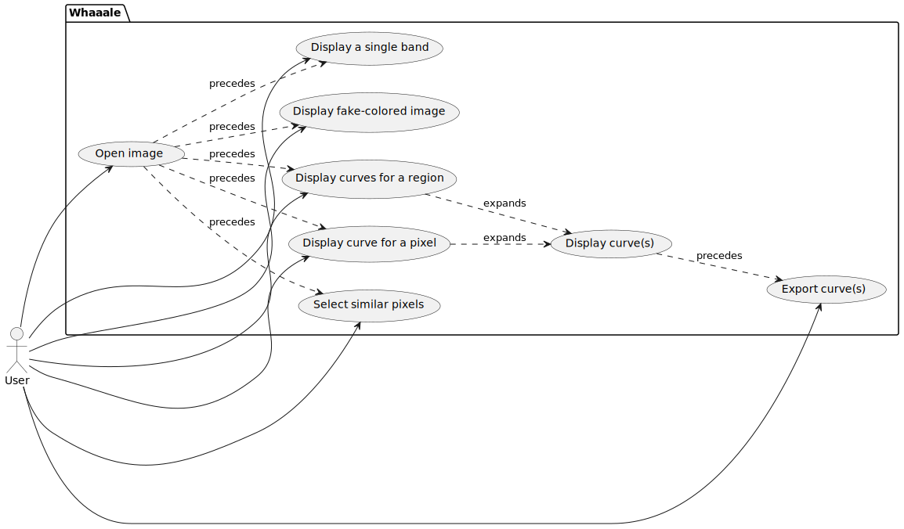

---
# Metadata
title: Analysis and project requirements
author: "Krzysztof Dziembała"
date: \today

# Pandoc document settings
standalone: true
lang: en-GB
# Pandoc LaTeX variables
geometry: [a4paper, bindingoffset=0mm, inner=30mm, outer=30mm, top=30mm, bottom=30mm]
# documentclass: report
fontsize: 12pt
colorlinks: true
numbersections: true
toc: false
lof: false # List of figures

# header-includes:
  # Remove "Chapter N" from the line above chapter name in report class document
  # I could not include a file for some reason, but this works
  # - |
  #   ````{=latex}
  #   \usepackage{titlesec}
  #   \titleformat{\chapter}
  #     {\normalfont\LARGE\bfseries}{Task \thechapter.}{1em}{}
  #   \titlespacing*{\chapter}{0pt}{3.5ex plus 1ex minus .2ex}{2.3ex plus .2ex}
  #   ````
  # Keep footnote numbering
  # - |
  #   ````{=latex}
  #   \counterwithout{footnote}{chapter}
  #   ````
---

<!-- Allow multiple top-level headers (interpreted as chapters by pandoc) -->
<!-- markdownlint-disable MD025 -->
# Use case diagram



# Requirements

## Functional

### 0 (POLSL-SE/whaaale#?)

zzz

## Non-functional

### Performance

???

### Portability

Program must be available for Linux and Windows. It must be possible to run the program without installing it. Program should be distributed as a ZIP archive.\
If possible without developer's license and code signing certificate, the program should be available for macOS.

### Usability

All buttons with icons must have a label visible after hovering them with a mouse cursor.

### Reliability

All errors during
